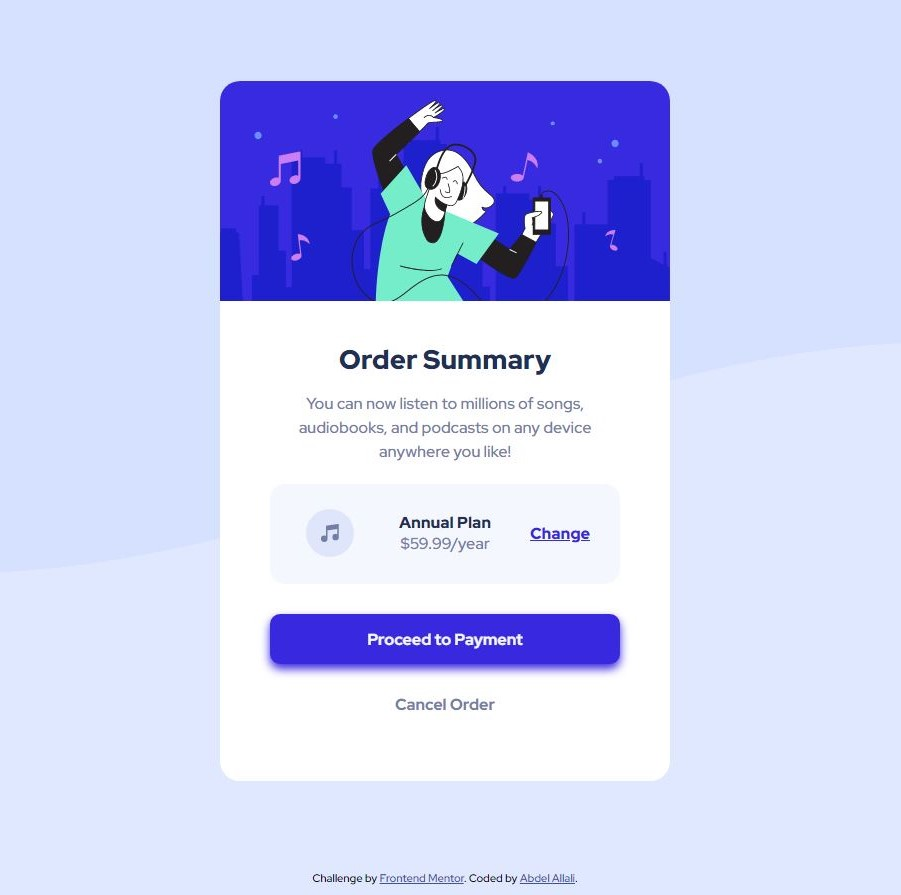

# Frontend Mentor - Order summary card solution

This is a solution to the [Order summary card challenge on Frontend Mentor](https://www.frontendmentor.io/challenges/order-summary-component-QlPmajDUj). Frontend Mentor challenges help you improve your coding skills by building realistic projects. 

## Table of contents

- [Overview](#overview)
  - [The challenge](#the-challenge)
  - [Screenshot](#screenshot)
  - [Links](#links)
  - [My process](#my-process)
  - [Built with](#built-with)
  - [What I learned](#what-i-learned)
  - [Continued development](#continued-development)
  - [Useful resources](#useful-resources)
- [Author](#author)
- [Acknowledgments](#acknowledgments)

**Note: Delete this note and update the table of contents based on what sections you keep.**

## Overview

### The challenge

Users should be able to:

- See hover states for interactive elements

### Screenshot




### Links

- Solution URL: https://github.com/Abdel-2020/order-summary-component-main
- Live Site URL: https://abdel-2020.github.io/order-summary-component-main/

## My process


### Built with

- Semantic HTML5 markup
- CSS custom properties
- Mobile-first workflow

### What I learned

Honestly? Not much, 

I had the aim to make my CSS look as clean as possible, since in bigger projects I always seem to lose myself....  And then giving up on it entirely. I created the general structure and styling for everything by using the element names as the selectors. This created a foundation for me to work with and tweak the unique areas which still needed styling. 

The below code made styling the rest of the card MUCH easier:


```css
:root {
    --pale-blue: hsl(225, 100%, 94%);
    --bright-blue: hsl(245, 75%, 52%);
    --very-pale-blue: hsl(225, 100%, 98%);
    --desaturated-blue: hsl(224, 23%, 55%);
    --dark-blue: hsl(223, 47%, 23%);
    --hover-bright-blue:hsl(245, 75% ,70%);

  }

  *{
      box-sizing:border-box;
      margin:0;
      padding:0;
      font-family: "Red hat Display";
  }

  h1{
    color:var(--dark-blue);
    font-weight:900;
  }

  p{
      font-size:16px;
      color: var(--desaturated-blue)
  }


  body{
    background-image: url("images/pattern-background-desktop.svg");
    background-repeat: no-repeat;
    background-size: 100vw; 
    background-color: var(--pale-blue);

  }

  section{
    width: 350px;
    margin:0 auto;
    text-align: center;
  }

```


If you want more help with writing markdown, we'd recommend checking out [The Markdown Guide](https://www.markdownguide.org/) to learn more.


### Continued development

Use this section to outline areas that you want to continue focusing on in future projects. These could be concepts you're still not completely comfortable with or techniques you found useful that you want to refine and perfect.


## Author
- Frontend Mentor - [@yourusername](https://www.frontendmentor.io/profile/yourusername)
- Twitter - [@abdelcodes](https://www.twitter.com/abdelcodes)

**Note: Delete this note and add/remove/edit lines above based on what links you'd like to share.**

## Acknowledgments

Me, myself and IIIIIIIIIIIIIIIIIIIIIIIIIIIIIIIIIIIIIIIIIIIIIIIIIIIIIIIIIIIIIIIIIIIIIIIIIIIIIIIIIIIII,

Big shout out to LoFi Girl who made this 3 hour sitting feel timeless, watch her at: https://youtu.be/5qap5aO4i9A